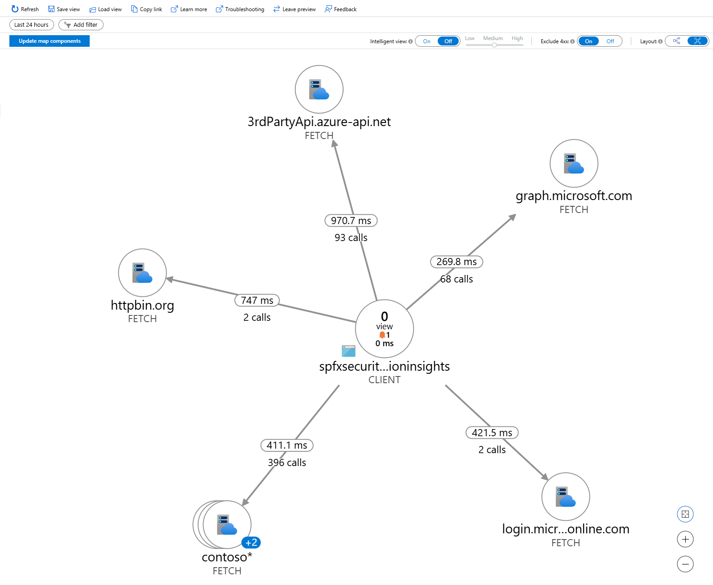

# External API calls tracking with Application Insights

> This SPFx solution is part of [SharePoint solutions as a spyware](https://pnp.github.io/blog/post/spfx-solutions-as-spyware/) series, focusing on improving security posture your Microsoft 365 environment.

## Summary

This SPFx solution is designed to monitor and track **API calls** executed within any SharePoint Online (SPO) site.

SPFx solutions are essentially functioning as **full-trust code within the SharePoint environment**. They may access SharePoint REST API, public APIs, and APIs secured by Azure AD (such as Microsoft Graph and Azure services).

**Public APIs and SharePoint REST API do not require consent and cannot be blocked.**
Although usage of **Microsoft Graph and other APIs secured with Azure AD** require administrator's approval, they **apply universally to all SPFx solutions within the tenant**. This introduces a potential security risk, as even malicious or unauthorized solutions may access sensitive APIs without requesting individual permissions.

Unfortunately, **it is impossible to fully review the code of SPFx solutions** to ensure that all API requests are legitimate. TypeScript code is transpiled to JavaScript, which often becomes unreadable, making it challenging to identify malicious activity. Additionally, malicious code may be hidden within dependencies, either intentionally or unknowingly by the developer. This can also occur as part of a supply chain attack, where compromised dependencies are introduced into the solution.

Given these risks, the best (if not only) way to **ensure that sensitive data is not stolen is to monitor the traffic generated by these solutions**. This can be achieved using a SPFx Application Customizer deployed tenant-wide to all sites, that tracks all API requests and sends them to Application Insights.

To optimize data gathering,** known endpoints may be whitelisted, reducing the amount of data logged**. Additionally, this solution allows for **temporarily disabling** logging to facilitate randomized "hunting" without continuously generating large volumes of data.

The logs collected include the called endpoints, methods (GET/POST), the originating page, and the user's geographic location based on the Client IP. neither user ID, not user's IP are captured.

Results can be reviewed using the **Application Map** in Application Insights or by executing **KUSTO query** against the Application Insights logs, offering powerful tools for analyzing and understanding API usage patterns.

For a more proactive approach, you may set up an alert based that automatically triggers when a new external API call is detected.

This alerting mechanism allows you to stay informed in real-time whenever an unfamiliar API request occurs.
If the alert conditions are met, an email notification will be sent to designated administrators or security personnel.

This proactive approach ensures that potential threats or unauthorized activities are quickly identified, allowing for prompt investigation and response before any damage can occur.

## Used SharePoint Framework Version

## Applies to

-   [SharePoint Framework](https://aka.ms/spfx)
-   [Microsoft 365 tenant](https://docs.microsoft.com/en-us/sharepoint/dev/spfx/set-up-your-developer-tenant)

> Get your own free development tenant by subscribing to [Microsoft 365 developer program](http://aka.ms/o365devprogram)

## Prerequisites

-   Azure tenant
-   [Application Insights](https://learn.microsoft.com/en-us/azure/azure-monitor/app/app-insights-overview)
-   SharePoint Administrator or Global Administrator to install the solution

## Solution

| Solution                                          | Author(s)                                  |
| ------------------------------------------------- | ------------------------------------------ |
| js-applicationinsights-api-calls-trackingpnpm run | [Kinga Kazala](https://github.com/kkazala) |

## Version history

| Version | Date            | Comments        |
| ------- | --------------- | --------------- |
| 1.0     | August 10, 2024 | Initial release |

## Disclaimer

**THIS CODE IS PROVIDED _AS IS_ WITHOUT WARRANTY OF ANY KIND, EITHER EXPRESS OR IMPLIED, INCLUDING ANY IMPLIED WARRANTIES OF FITNESS FOR A PARTICULAR PURPOSE, MERCHANTABILITY, OR NON-INFRINGEMENT.**

---

## Minimal Path to Awesome

-   Clone this repository
-   Ensure that you are at the solution folder
-   in the command-line run:
    -   **pnpm install**
    -   **gulp serve**

In order to deploy the solution:

-   in the command-line run:
    -   **gulp bundle --ship**
    -   **gulp package-solution --ship**
    -   you will find your newly created \*.sppkg file in the **sharepoint/solution** folder.
-   Upload or drag and drop the newly created client-side solution package to the **app catalog in your tenant**.
-   By default, the **Enable this app and add it to all sites check box** is selected. Click **Enable app** to add this application customizer to all modern SPO sites in your tenant.

## References

-   [Application Insights overview](https://learn.microsoft.com//azure/azure-monitor/app/app-insights-overview)
-   [Application Insights API for custom events and metrics](https://learn.microsoft.com/en-us/azure/azure-monitor/app/api-custom-events-metrics)
-   [Dynamic instrumentation key](https://learn.microsoft.com/en-us/azure/azure-monitor/app/api-custom-events-metrics)

-   [Getting started with SharePoint Framework](https://docs.microsoft.com/en-us/sharepoint/dev/spfx/set-up-your-developer-tenant)
-   [Building for Microsoft teams](https://docs.microsoft.com/en-us/sharepoint/dev/spfx/build-for-teams-overview)
-   [Use Microsoft Graph in your solution](https://docs.microsoft.com/en-us/sharepoint/dev/spfx/web-parts/get-started/using-microsoft-graph-apis)
-   [Publish SharePoint Framework applications to the Marketplace](https://docs.microsoft.com/en-us/sharepoint/dev/spfx/publish-to-marketplace-overview)
-   [Microsoft 365 Patterns and Practices](https://aka.ms/m365pnp) - Guidance, tooling, samples and open-source controls for your Microsoft 365 development
