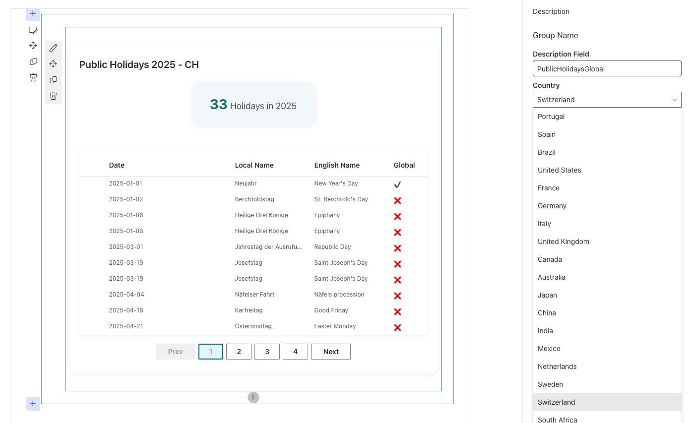

# Public Holidays Global

## Summary

This SharePoint Framework (SPFx) web part displays public holidays for multiple countries and years. Users can select the country via the property pane, view holidays for the current year, navigate through paginated results, and visualize the total holidays across the last 4 years with a dynamic bar chart.

The solution uses **React**, **Fluent UI**, and **Recharts** for a responsive, modern experience. It integrates with the [Nager.Date Public Holidays API](https://date.nager.at/) to retrieve holiday data in real time from the following endpoint structure:

```
https://date.nager.at/api/v3/PublicHolidays/{year}/{countryCode}
```

Example for Portugal 2025:

```
https://date.nager.at/api/v3/PublicHolidays/2025/PT
```



## Compatibility

| :warning: Important                                                                                                                   |
| :------------------------------------------------------------------------------------------------------------------------------------ |
| This sample requires Node.js v18.x to build and run successfully. Make sure your environment matches the supported versions for SPFx. |
| See [https://aka.ms/spfx-matrix](https://aka.ms/spfx-matrix) for official SPFx compatibility details.                                 |

This sample is compatible with:


## Applies to

* [SharePoint Framework](https://aka.ms/spfx)
* [Microsoft 365 tenant](https://learn.microsoft.com/en-us/sharepoint/dev/spfx/set-up-your-developer-tenant)

> Get your own free development tenant by joining the [Microsoft 365 developer program](https://aka.ms/o365devprogram).

## Prerequisites

* Node.js LTS (v18.x)
* npm package manager
* SharePoint Online site collection for testing

## Contributors

* [João LIVIO](https://github.com/jtlivio)

## Version History

| Version | Date          | Comments        |
| ------- | ------------- | --------------- |
| 1.0     | June 17, 2025 | Initial release |

## Minimal Path to Awesome

To test this solution in your environment:

```bash
npm install
gulp serve
```

> Then open the SharePoint Online hosted workbench and add the **"Public Holidays Global"** web part.

## Features

This web part demonstrates the following:

* Select country from property pane dropdown
* Fetch and display public holidays by year and country
* Pagination of holiday list (10 per page)
* Indicator showing current holiday count and change vs previous year
* Interactive bar chart with % of holidays per year
* Responsive layout using Fluent UI
* Graceful handling of loading and API errors

## References

* [SharePoint Framework documentation](https://learn.microsoft.com/en-us/sharepoint/dev/spfx/set-up-your-developer-tenant)
* [Fluent UI React components](https://developer.microsoft.com/en-us/fluentui#/controls/web)
* [Recharts documentation](https://recharts.org/en-US/)
* [Public Holidays API – Nager.Date](https://date.nager.at/Api)

## Help

This sample is community-supported. For questions or issues:

* Check [open issues related to this sample](https://github.com/pnp/sp-dev-fx-webparts/issues?q=label%3A%22sample%3A%20react-public-holidays-global%22)
* Browse [discussions for this sample](https://github.com/pnp/sp-dev-fx-webparts/discussions?discussions_q=react-public-holidays-global)
* [Create a new issue](https://github.com/pnp/sp-dev-fx-webparts/issues/new) if needed

## Disclaimer

**THIS CODE IS PROVIDED *AS IS* WITHOUT WARRANTY OF ANY KIND, EXPRESS OR IMPLIED, INCLUDING BUT NOT LIMITED TO THE IMPLIED WARRANTIES OF MERCHANTABILITY OR FITNESS FOR A PARTICULAR PURPOSE.**

---


