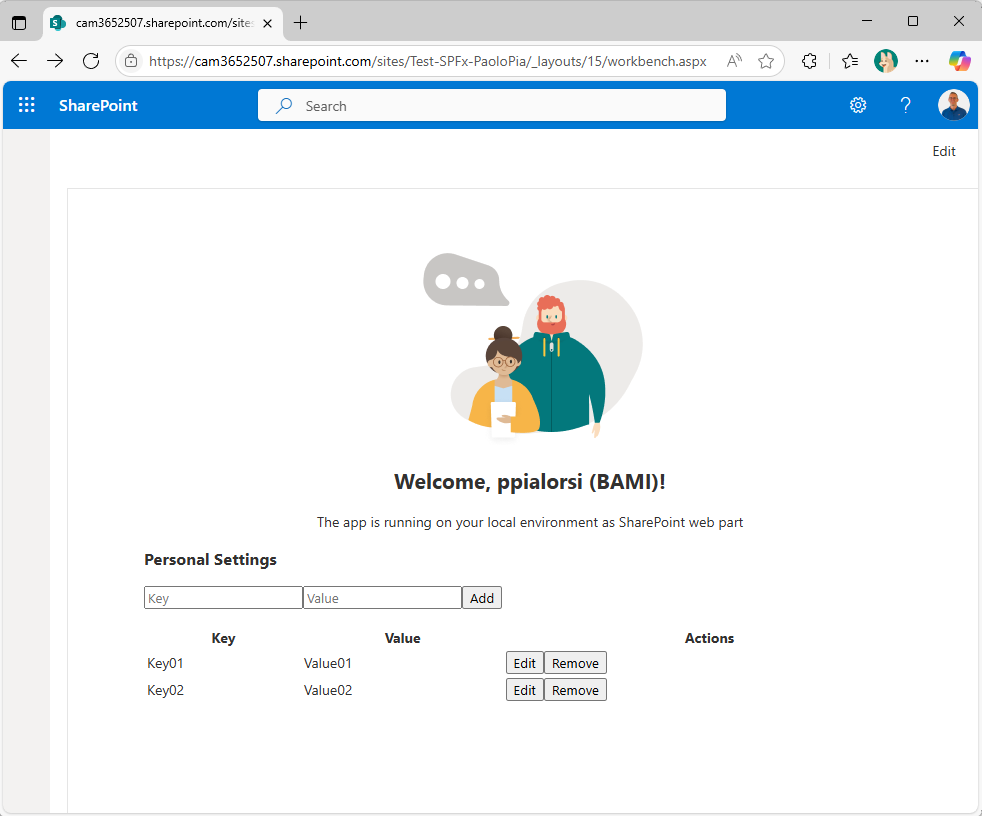

# Personal Settings Sample Solution

This repository contains a sample solution demonstrating how to securely store and manage user-specific configuration settings in SharePoint using a SPFx Web Part and an Azure Function API leveraging Microsoft Graph special folders (approot).

## Solution Structure

- **spfx-personal-settings-webpart/**: SPFx Web Part (React, TypeScript) for users to manage their personal settings. Authenticates with Entra ID and calls the backend API securely.
- **azure-function-personal-settings-api/**: Azure Function (Node.js, TypeScript) providing REST endpoints to save, read, remove, and list settings. Uses Microsoft Graph special folders (approot) and the on-behalf-of flow for delegated access.

## How It Works

1. The SPFx Web Part authenticates the user via Entra ID and obtains an access token.
2. The Web Part calls the Azure Function API, passing the user's token.
3. The Azure Function uses the on-behalf-of flow to call Microsoft Graph and store/retrieve settings in the user's approot special folder.

## Prerequisites

- Node.js LTS
- Yeoman generator for SPFx
- Azure Functions Core Tools
- Azure Subscription
- Entra ID (Azure AD) admin access

## Setup Instructions

### 1. Register Entra ID Applications
- Register one app for the SPFx Web Part (client) and one for the Azure Function (API).
- Configure API permissions for Microsoft Graph (Files.ReadWrite.AppFolder, offline_access, openid, profile, email).
- Enable the on-behalf-of flow for the API app.
- Expose the API app as a scope and grant permissions to the client app.

### 2. Deploy the Azure Function
- Go to `back-end/`
- Copy `.env.sample` to `.env` and fill in your real values for all secrets and IDs.
- Copy `local.settings.sample.json` to `local.settings.json` and fill in your real values for local development.
- Install dependencies and build: `npm install && npm run build`
- Deploy to Azure Functions
- Configure application settings for Entra ID (client ID, tenant ID, client secret)

### 3. Deploy the SPFx Web Part
- Go to `front-end/`
- Run `npm install`
- Update the API endpoint and Entra ID app details in the code/config
- Package and deploy the Web Part to your SharePoint App Catalog
- Add the Web Part to a SharePoint page

## Usage

- Users can add the Web Part to a SharePoint page and manage their personal settings.
- All settings are securely stored in the user's own Microsoft 365 account using the approot special folder.

## References
- [Microsoft Graph Special Folders](https://learn.microsoft.com/en-us/graph/api/drive-get-specialfolder?view=graph-rest-1.0&tabs=http)
- [SPFx Web Parts](https://learn.microsoft.com/en-us/sharepoint/dev/spfx/web-parts/overview-client-side-web-parts)
- [Azure Functions](https://learn.microsoft.com/en-us/azure/azure-functions/)
- [On-Behalf-Of Flow](https://learn.microsoft.com/en-us/azure/active-directory/develop/v2-oauth2-on-behalf-of-flow)

---

This sample is provided as-is for community use and learning.
