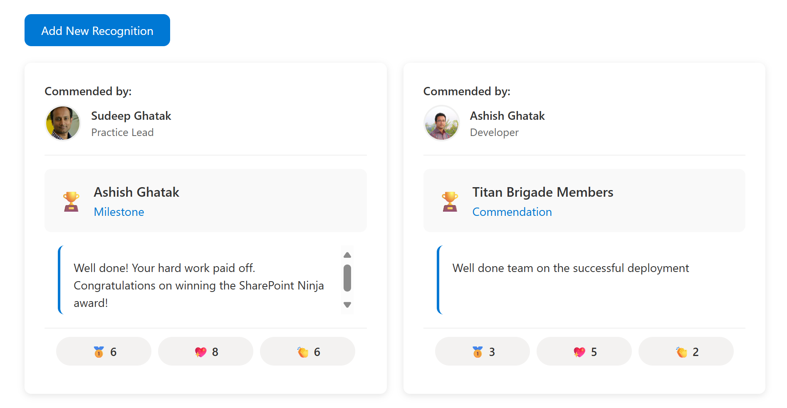

# react-sp-emp-recognition

## Summary

This SharePoint Framework (SPFx) web part enables organizations to celebrate employee achievements and contributions through a modern recognition system. Users can easily nominate colleagues for various types of recognition and engage with these recognitions through social reactions.

## Features
- Responsive design based on Fluent UI components
- Recognition Form: User-friendly form with people pickers for sender and recipient
- Interactive reaction buttons (medals, hearts, claps)
- Adapts to different screen sizes

## Used SharePoint Framework Version

## Applies to

- [SharePoint Framework](https://aka.ms/spfx)
- [Microsoft 365 tenant](https://docs.microsoft.com/en-us/sharepoint/dev/spfx/set-up-your-developer-tenant)

> Get your own free development tenant by subscribing to [Microsoft 365 developer program](http://aka.ms/o365devprogram)

## Prerequisites

SharePoint list named "Employee Recognition" with the following fields:
- Title (Single line of text)
- From (Person or Group)
- To (Person or Group)
- Message (Multiple lines of text)
- AwardType (Choice)
- Reactions_Medal (Number)
- Reactions_Heart (Number)
- Reactions_Clap (Number)
- DateRecognized (Date and Time)

## Compatibility

| :warning: Important          |
|:---------------------------|
| Every SPFx version is only compatible with specific version(s) of Node.js. In order to be able to build this sample, please ensure that the version of Node on your workstation matches one of the versions listed in this section. This sample will not work on a different version of Node.|
|Refer to <https://aka.ms/spfx-matrix> for more information on SPFx compatibility.   |

 
 

-Incompatible-red.svg "SharePoint Server 2016 Feature Pack 2 requires SPFx 1.1")

## Applies to

* [SharePoint Framework Developer Preview](https://learn.microsoft.com/sharepoint/dev/spfx/sharepoint-framework-overview)
* [Office 365 developer tenant](https://learn.microsoft.com/sharepoint/dev/spfx/set-up-your-developer-tenant)

## Contributors

* [Sudeep Ghatak](https://github.com/sudeepghatak)

## Version history

Version|Date|Comments
-------|----|--------
1.0|April 20, 2025|Initial release

## Minimal Path to Awesome

### Build and Test

>  This sample can also be opened with [VS Code Remote Development](https://code.visualstudio.com/docs/remote/remote-overview). Visit https://aka.ms/spfx-devcontainer for further instructions.

1. Clone this repo
2. In the command line run
    - `npm i`
    - `gulp build`
    - `gulp serve --nobrowser`
3. Create a custom list (e.g. Employees) 
5. Navigate to the hosted version of SharePoint workbench, eg. **https://\<tenant>.sharepoint.com/sites/\<your site>/_layouts/15/workbench.aspx**
6. Add the Web Part to the canvas and configure it.

### Package and deploy

1. In the command line run
    - `gulp bundle --ship`
    - `gulp package-solution --ship`
2. Install into your SharePoint app catalog and add it to a SharePoint site.
3. Navigate to your site, eg. **https://\<tenant>.sharepoint.com/sites/\<your site>**
4. Create a custom list with Title and Description(internal name) of type Enhanced rich text. 
5. Populate the list with some items
6. Navigate to a page on your site where the custom list is created
7. Add the Web Part to the page and configure it.

## Features

- **Instant Filtering**:  
  - Enter a name to quickly filter visible employees.  
  - Matches partial names, case-insensitive.

- **Gradient Background Cards**:  
  - Employee cards styled with customizable gradient colors.

- **Custom Gradient Option**:  
  - Gradient color can be changed from the web part properties pane.  
  - Easily adaptable to different branding needs.

## Help

We do not support samples, but we this community is always willing to help, and we want to improve these samples. We use GitHub to track issues, which makes it easy for  community members to volunteer their time and help resolve issues.

If you're having issues building the solution, please run [spfx doctor](https://pnp.github.io/cli-microsoft365/cmd/spfx/spfx-doctor/) from within the solution folder to diagnose incompatibility issues with your environment.

If you encounter any issues while using this sample, [create a new issue](https://github.com/pnp/sp-dev-fx-webparts/issues/new?assignees=&labels=Needs%3A+Triage+%3Amag%3A%2Ctype%3Abug-suspected%2Csample%3A%20react-sp-org_chart&template=bug-report.yml&sample=react-sp-org_chart&authors=@sudeepghatak&title=react-sp-org_chart).

For questions regarding this sample, [create a new question](https://github.com/pnp/sp-dev-fx-webparts/issues/new?assignees=&labels=Needs%3A+Triage+%3Amag%3A%2Ctype%3Aquestion%2Csample%3A%20react-sp-org_chart&template=bug-report.yml&sample=react-sp-org_chart&authors=@sudeepghatak&title=react-sp-org_chart).

Finally, if you have an idea for improvement, [make a suggestion](https://github.com/pnp/sp-dev-fx-webparts/issues/new?assignees=&labels=Needs%3A+Triage+%3Amag%3A%2Ctype%3Aenhancement%2Csample%3A%20react-sp-org_chart&template=bug-report.yml&sample=react-sp-org_chart&authors=@sudeepghatak&title=react-sp-org_chart).

## Disclaimer

**THIS CODE IS PROVIDED *AS IS* WITHOUT WARRANTY OF ANY KIND, EITHER EXPRESS OR IMPLIED, INCLUDING ANY IMPLIED WARRANTIES OF FITNESS FOR A PARTICULAR PURPOSE, MERCHANTABILITY, OR NON-INFRINGEMENT.**